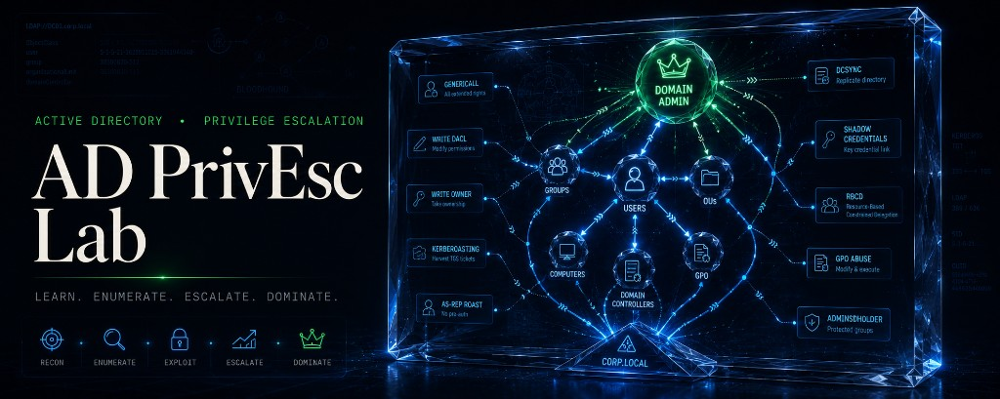

<p align="center">
  
</p>

<p align="center">
  <strong>Aprende privilege escalation en Active Directory por firma, no de memoria.</strong><br/>
  Laboratorio visual local: <code>whoami /priv → firma → ficha → practicar → mitigar</code>
</p>

<p align="center">
  <a href="https://github.com/heindall92/AD-PrivEsc-Lab"></a>
  
  
  
  
  
  
  
</p>

> **Solo para entornos controlados y autorizados:** HackTheBox, TryHackMe, VulnHub, GOAD, laboratorios propios y ejercicios con permiso explícito por escrito. El uso ofensivo fuera de ese alcance es ilegal.

---

## ¿Por qué existe este lab?

La mayoría de cheatsheets de privilege escalation enseñan **herramientas**. Este lab enseña **patrones**.

En un engagement (o en un lab) no fallas porque no sepas el nombre de Potato: fallas porque no reconoces que `SeImpersonatePrivilege` Enabled + un servicio SYSTEM es la firma de una ruta local. AD PrivEsc Lab fuerza ese músculo:

```text
observar (whoami /priv, enum) → reconocer firma → abrir ficha → practicar → mitigar
```

La UI y la pedagogía calcán el formato del lab hermano [ADCS-ESC-Lab](https://github.com/heindall92/ADCS-ESC-Lab): mapa, tabla, ficha, práctica, decisión, cheat sheet y blue team — pero el dominio es **privilege escalation** (local + Active Directory), no ADCS ESC1–16.

---

## ¿Qué incluye?

### Capas de contenido

| Capa | Qué cubre | Dónde |
|------|-----------|--------|
| **Curso** | 11 privilegios Se* del material del profesor | `/curso` |
| **Dominio (OCD)** | Kerberos, ACL, Delegation, Coerce/Relay, Creds, Trusts, SCCM, MSSQL, misc | `/mapa`, `/tabla` |
| **ADCS** | Puente pedagógico (no duplica ESC1–16) | `/adcs` → [ADCS-ESC-Lab](https://github.com/heindall92/ADCS-ESC-Lab) |

### Cobertura actual (64 vectores, 0 stubs)

| Categoría | # | Ejemplos |
|-----------|---|---------|
| Local / Se* | 16 | SeImpersonate, SeBackup, unquoted path, DLL hijack… |
| Kerberos | 7 | AS-REP Roast, Kerberoasting, Golden/Silver/Diamond… |
| ACL / ACE | 10 | GenericAll, WriteDacl, DCSync, Shadow Credentials… |
| Delegation | 3 | Unconstrained, Constrained, RBCD |
| Coerce / Relay | 6 | PetitPotam, PrinterBug, WebDAV, NTLM relay… |
| Credentials | 6 | SAM/LSA, LSASS, DPAPI, GPP, LAPS, NTDS |
| Trusts | 3 | SID History, inter-realm TGT, forest trust |
| ADCS (puente) | 2 | Enum / bridge hacia el lab ESC |
| SCCM | 3 | NAA, site admin, coerce |
| MSSQL | 3 | xp_cmdshell, linked server, impersonation |
| Misc | 5 | HiveNightmare, MAQ, NoPac, PrintNightmare, GPO abuse |

Taxonomía inspirada en el [mindmap AD 2025.03 de Orange Cyberdefense](https://orange-cyberdefense.github.io/ocd-mindmaps/) — referencia educativa con atribución; **no** es una copia hoja-a-hoja del mindmap completo.

### Cada ficha incluye

1. **En una frase** — qué es el vector  
2. **Por qué importa** — impacto pedagógico  
3. **Firma** — cómo lo reconoces en lab  
4. **Pasos** — flujo educativo (comandos de referencia + “para qué”)  
5. **Detección / hardening** — cierre blue team  

---

## Stack

- **React 19** + **TanStack Start / Router** + **TypeScript**
- **Tailwind CSS v4** + UI Radix / shadcn-style
- **Motion** para microinteracciones; hero full-bleed con banner estático
- Datos bilingües ES/EN en `src/lib/data/`
- 100% local — sin backend obligatorio

Tema por defecto: **oscuro + acento azul** (alineado al branding del banner). El usuario puede cambiar tema y acento; la preferencia se guarda en `localStorage`.

---

## Requisitos

| Requisito | Versión |
|-----------|---------|
| Node.js   | 20+     |
| npm       | 10+     |

Herramientas citadas en las fichas (no se empaquetan): Impacket, BloodHound, Rubeus, Mimikatz, Certipy (vía lab ADCS), etc. Úsalas solo en labs autorizados.

---

## Inicio rápido

```bash
git clone https://github.com/heindall92/AD-PrivEsc-Lab.git
cd AD-PrivEsc-Lab
npm install
npm run dev
```

Abre **http://localhost:8080**.

```bash
npm run build    # build de producción
npm run preview  # previsualizar el build
```

---

## Rutas

| Ruta | Descripción |
|------|-------------|
| `/` | Home cinematográfico + tutorial + recorrido |
| `/curso` | Solo los 11 Se* del curso |
| `/mapa` | Mapa por categorías OCD |
| `/tabla` | Tabla maestra comparable |
| `/vector/$vectorId` | Ficha (ej. `/vector/se-impersonate`) |
| `/practica` | Escenarios guiados |
| `/decision` | Si ves esta firma → abre este vector |
| `/cheat-sheet` | Firmas rápidas |
| `/blue-team` | Detección y hardening |
| `/parche` | Checklist de hardening |
| `/adcs` | Puente a ADCS-ESC-Lab |

---

## Estructura (resumen)

```text
src/
  components/     # Hero, sidebar, fichas, práctica, UI
  lib/data/       # Vectores ES/EN, práctica, tipos
  routes/         # TanStack Router
public/
  hero-banner.png # Banner hero
  favicon.png     # Logo A del lab
Multimedia/       # Banner README, assets de marca
```

---

## Metodología de aprendizaje sugerida

1. Empieza en **`/curso`** — los 11 Se* sin ruido de dominio.  
2. Para cada privilegio: `whoami /priv` → firma → ficha → un escenario en **`/practica`**.  
3. Sube a **`/mapa`**: Kerberos → ACL → Delegation.  
4. Cruza con **`/decision`** y **`/cheat-sheet`** hasta que la firma salga sola.  
5. Cierra siempre en **`/blue-team`** / **`/parche`**.  
6. Si el camino toca certificados: **`/adcs`**.

---

## Atribución

- **UI / pedagogía:** fork metodológico de [ADCS-ESC-Lab](https://github.com/heindall92/ADCS-ESC-Lab)
- **Taxonomía de dominio:** [Orange Cyberdefense — OCD mindmaps](https://github.com/Orange-Cyberdefense/ocd-mindmaps) (uso educativo; atribución obligatoria)
- **Curso Se*:** material académico del profesor (privilegios Windows)
- **Branding / hero:** assets propios del proyecto (banner + logo A)

---

## Aviso legal y ético

Proyecto **exclusivamente educativo**.

- Úsalo solo en sistemas propios, laboratorios autorizados o auditorías con **autorización escrita**.
- No atacar redes de terceros.
- El autor no se responsabiliza del uso indebido de técnicas o comandos descritos.

---

## Licencia

Distribuido bajo **[MIT License](LICENSE)** · Copyright © 2026 Yoandy Ramírez Delgado.

---

## Autor

**Yoandy Ramírez Delgado** · Junior Pentester · eJPTv2

[](https://www.linkedin.com/in/yoandyrd92)
[](https://app.hackthebox.com/users/heindall)
